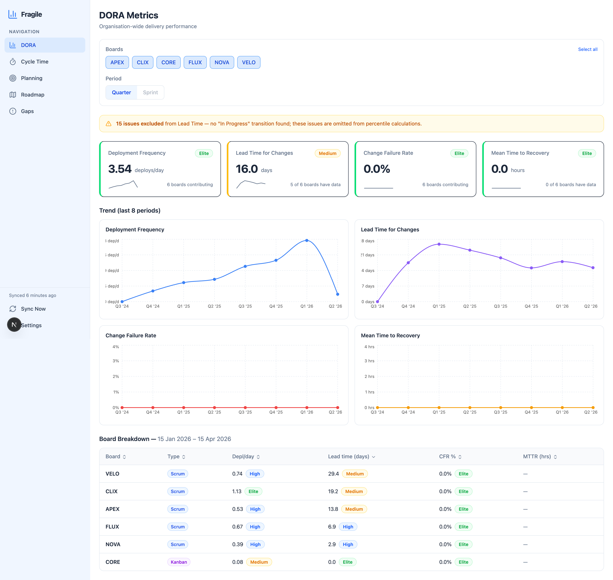
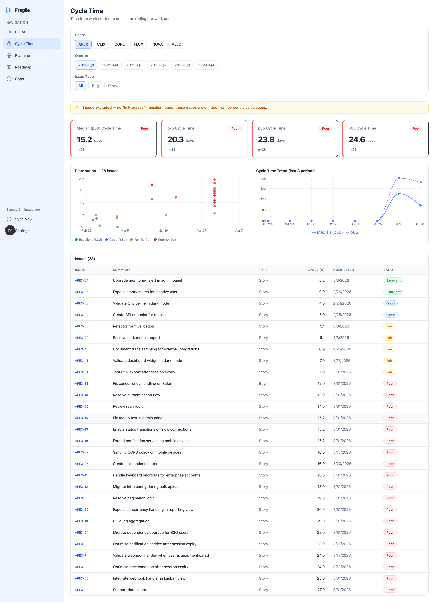
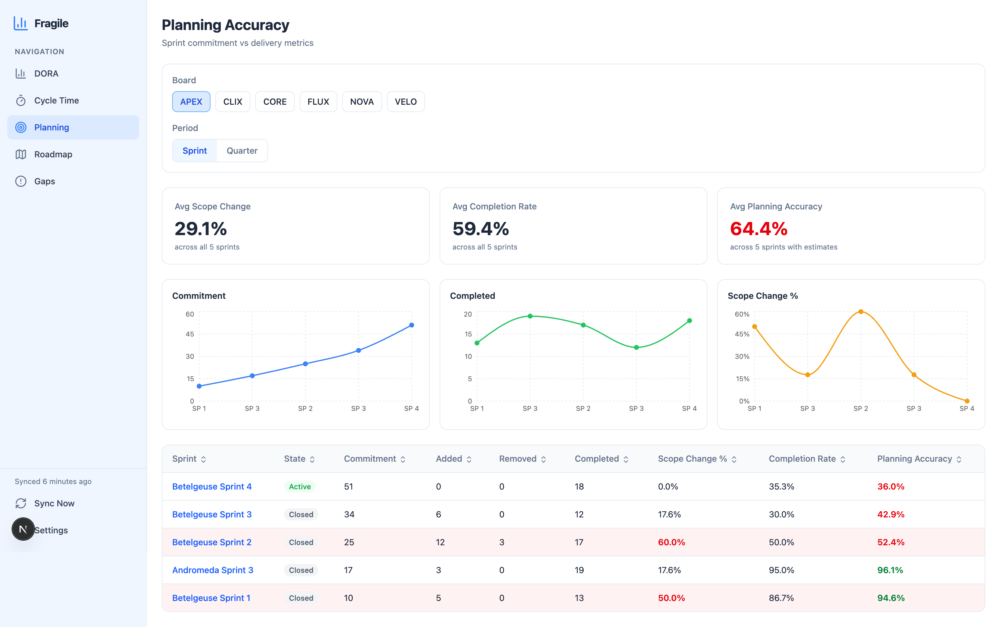
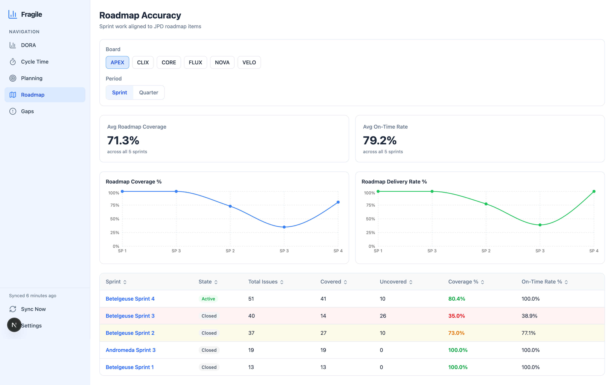
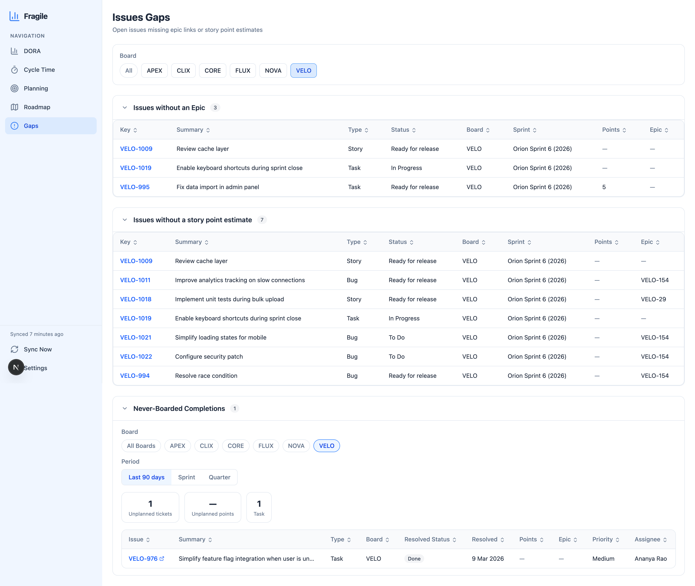

# Fragile

Fragile is a self-hosted engineering metrics dashboard that connects to a Jira Cloud instance
and surfaces DORA metrics, sprint and Kanban planning analytics, cycle time analysis, and
roadmap accuracy tracking. It is designed for small engineering teams who want actionable
delivery data without leaving their existing Jira workflow.

All Jira data is synced into a local PostgreSQL database on demand. Metric calculations run
against the cached data, keeping the UI fast and Jira API usage low. Every aspect of the metric
rules — done statuses, failure issue types, incident definitions, roadmap date field IDs — is
configurable per board through the Settings UI, with no hardcoded assumptions in the codebase.

Fragile is an intentionally simple, single-user internal tool. There is no login screen and no
user management. It is designed to run on a private network or localhost and to be trusted by the
team that operates it.

---

## Screenshots

**DORA Metrics** — organisation-wide delivery performance across all boards



**Cycle Time** — distribution scatter plot with percentile cards and trend



**Planning Accuracy** — sprint commitment vs delivery with scope change tracking



**Roadmap Accuracy** — sprint work aligned to JPD roadmap items



**Issues Gaps** — open issues missing epic links or story point estimates



---

## Features

### DORA Metrics

The DORA page shows all four DORA metrics — Deployment Frequency, Lead Time for Changes, Change
Failure Rate, and MTTR — at the organisation level and broken down per board. Toggle between week
and quarter views. Each metric card carries a DORA band badge (Elite / Good / Fair / Poor) derived
from the DORA research thresholds, and a board breakdown table allows comparison across projects.

### Cycle Time

The Cycle Time page plots individual issue cycle times on a scatter chart with a trend line. Three
percentile cards (p50, p75, p95) summarise the distribution. Each data point is annotated with its
DORA band. Epics and sub-tasks are excluded from all cycle time calculations. Supports per-board
filtering and week/quarter time range toggles.

### Planning (Sprint)

The Planning page provides a per-sprint breakdown for Scrum boards: issue count, story points,
completion rate, and scope change percentage. Sprint membership history is reconstructed from the
Jira changelog so that issues added or removed mid-sprint are counted accurately. Active sprints
are flagged in the UI.

### Planning (Kanban)

Kanban boards have no sprints. The Planning page adapts to show issues grouped by the week or
quarter in which they first entered the board (board-entry date derived from changelog). Completion
rate and throughput are shown per period. The `dataStartDate` board config field prevents old
backlog issues from inflating Kanban period counts.

### Roadmap Accuracy

The Roadmap page tracks whether delivered issues were backed by an active Jira Product Discovery
(JPD) idea. Two metrics are reported:

- **Roadmap Coverage** — percentage of completed issues that are linked (via epic) to a JPD idea
  that was active during the delivery period.
- **Roadmap Delivery Rate** — percentage of covered issues that were actually completed.

A JPD idea is considered active only during its `startDate`–`targetDate` window. Both dates are
read from tenant-specific Polaris interval custom fields, configured in the Settings UI.

### Settings

The Settings page exposes per-board configuration (done status names, in-progress status names,
failure issue types, failure labels, failure link types, incident types, incident priorities,
recovery statuses, backlog status IDs, and data start date) and per-JPD-project configuration
(start date field ID, target date field ID). Changes are persisted to PostgreSQL and take effect
on the next data request without requiring a restart.

### Sync

A manual sync button in the Settings page triggers a full refresh of sprints, issues, changelogs,
versions, and JPD ideas from Jira. Sync status and last-synced timestamps are displayed per board.
Sync history (issue count, status, error messages) is stored in the `sync_logs` table.

---

## Tech Stack

| Layer | Technology |
|---|---|
| Frontend framework | Next.js 16 (App Router), React 19 |
| Frontend language | TypeScript (strict, no semicolons) |
| Styling | Tailwind CSS v4 (CSS-first configuration) |
| Charts | Recharts |
| State management | Zustand |
| Icons | lucide-react |
| Backend framework | NestJS 11 |
| Backend language | TypeScript (strict, semicolons, `.js` ESM imports) |
| ORM | TypeORM |
| Database | PostgreSQL 16 |
| Jira integration | Jira Cloud REST API v3 + Agile API v1 (Basic auth) |
| Task automation | GNU Make |
| Local infrastructure | Docker Compose |

**Default ports:** Frontend `:3000` | Backend `:3001` | PostgreSQL `:5432`

---

## Prerequisites

- **Node.js 20 or later** (both backend and frontend)
- **PostgreSQL 16** — Docker is the simplest path (see Quick Start); an existing PostgreSQL
  instance works equally well
- **Docker** (optional, but recommended for running PostgreSQL locally)
- **A Jira Cloud account** with:
  - At least one Jira Software project (Scrum or Kanban)
  - An API token (see [Jira Setup](#jira-setup))
  - Optionally, one or more Jira Product Discovery projects for roadmap accuracy

---

## Quick Start

### 1. Clone the repository

```bash
git clone https://github.com/your-org/fragile.git
cd fragile
```

### 2. Start PostgreSQL

Using Docker (recommended):

```bash
docker run -d \
  --name fragile-db \
  -e POSTGRES_PASSWORD=postgres \
  -e POSTGRES_DB=fragile \
  -p 5432:5432 \
  postgres:16-alpine
```

Or use the provided Docker Compose file:

```bash
docker compose up -d
```

> **Note:** `docker-compose.yml` defaults to the database name `fragile`. If you want to use
> a different name, edit both `docker-compose.yml` (the `POSTGRES_DB`
> environment variable) and `DB_DATABASE` in `backend/.env` to match.

### 3. Configure the backend

```bash
cp backend/.env.example backend/.env
```

Edit `backend/.env` and fill in your Jira credentials:

```dotenv
JIRA_BASE_URL=https://yourorg.atlassian.net
JIRA_USER_EMAIL=you@yourorg.com
JIRA_API_TOKEN=your_jira_api_token
DB_HOST=localhost
DB_PORT=5432
DB_USERNAME=postgres
DB_PASSWORD=postgres
DB_DATABASE=fragile
PORT=3001
FRONTEND_URL=http://localhost:3000
TIMEZONE=UTC
```

> **Note:** `JIRA_BOARD_IDS` has been removed from the `.env` file. Boards are now registered
> through the Settings UI or via `backend/config/boards.yaml` (see
> [YAML Configuration](#yaml-configuration) below).

### 3a. Configure boards and roadmaps via YAML (recommended)

Fragile can pre-populate its board and roadmap configuration from two YAML files that live in
`backend/config/`. This is the recommended setup path — it is faster than configuring everything
through the Settings UI and can be committed to version control.

Copy the annotated example files:

```bash
cp backend/config/boards.example.yaml backend/config/boards.yaml
cp backend/config/roadmap.example.yaml backend/config/roadmap.yaml
```

These files are in `.gitignore` by default (they contain deployment-specific values). The
`*.example.yaml` templates are tracked in git and serve as the canonical field reference.

Both files are read by `YamlConfigService` on every application startup. Values in the YAML
files **overwrite** matching database rows on each restart. Boards or roadmaps in the database
that are absent from the YAML files are left untouched. This means partial YAML is safe — you
only need to list the boards you want to seed or override.

**`backend/config/boards.yaml`**

```yaml
boards:
  # Scrum board
  - boardId: ACC            # Jira project key — must be unique, normalised to UPPERCASE
    boardType: scrum        # "scrum" or "kanban"
    doneStatusNames:
      - Done
      - Released
    inProgressStatusNames:
      - In Progress
      - In Review
    cancelledStatusNames:
      - Cancelled
      - "Won't Do"
    failureIssueTypes:      # Issue types that count toward Change Failure Rate
      - Bug
      - Incident
    failureLinkTypes:       # Link type names that flag a failure relationship
      - "is caused by"
      - "caused by"
    failureLabels:          # Issue labels that mark a deployment failure
      - regression
      - hotfix
    incidentIssueTypes:     # Issue types used for MTTR calculation
      - Bug
      - Incident
    recoveryStatusNames:    # Status names that mark incident resolution (MTTR end)
      - Done
      - Resolved
    incidentLabels: []      # Additional labels for incident detection
    incidentPriorities:
      - Critical
    backlogStatusIds: []    # Status IDs representing pre-board backlog (Kanban only)
    dataStartDate: null     # ISO date or null — lower bound for Kanban flow metrics

  # Kanban board — note backlogStatusIds and dataStartDate
  - boardId: PLAT
    boardType: kanban
    doneStatusNames:
      - Done
      - Released
    inProgressStatusNames:
      - In Progress
    cancelledStatusNames:
      - Cancelled
    failureIssueTypes:
      - Bug
    failureLinkTypes:
      - "is caused by"
    failureLabels:
      - regression
    incidentIssueTypes:
      - Bug
    recoveryStatusNames:
      - Done
    incidentLabels: []
    incidentPriorities:
      - Critical
    backlogStatusIds:
      - "10303"             # Jira status ID for the backlog column — issues here are excluded
    dataStartDate: "2024-01-01"   # Exclude issues that entered the board before this date
```

**`backend/config/roadmap.yaml`**

```yaml
roadmaps:
  - jpdKey: DISC                          # Jira Product Discovery project key
    description: "Discovery roadmap"       # Optional human-readable label
    startDateFieldId: "customfield_10015"  # Custom field ID for the idea start date
    targetDateFieldId: "customfield_10021" # Custom field ID for the idea target/end date

  - jpdKey: STRAT
    description: "Strategic initiatives"
    startDateFieldId: null    # null = field not mapped; ideas excluded from coverage
    targetDateFieldId: null
```

To find the custom field IDs for JPD date fields, see [Configuring JPD date fields](#configuring-jpd-date-fields).

If either YAML file is absent at startup, the application starts normally and all configuration
falls back to the Settings UI — no error is raised and no migration is required.

### 4. Configure the frontend

```bash
cp frontend/.env.example frontend/.env
```

`frontend/.env` only needs one variable:

```dotenv
NEXT_PUBLIC_API_URL=http://localhost:3001
```

### 5. Install dependencies

```bash
make install
```

Or manually:

```bash
cd backend && npm install
cd ../frontend && npm install
```

### 6. Run database migrations

The backend must be compiled before migrations can run because `data-source.ts` references
compiled output in `dist/`.

```bash
make migrate
```

Or manually:

```bash
cd backend && npm run build && npm run migration:run
```

### 7. Start the development servers

Open two terminals:

```bash
# Terminal 1 — backend (NestJS, port 3001)
make dev-api

# Terminal 2 — frontend (Next.js, port 3000)
make dev-web
```

Open [http://localhost:3000](http://localhost:3000) in your browser.

### 8. Trigger the first sync

Navigate to **Settings** in the sidebar and click **Sync now**. The initial sync may take a
minute or two depending on the number of issues and boards. Subsequent syncs are incremental.

---

## Makefile Reference

| Target | Description |
|---|---|
| `make install` | Install npm dependencies for both backend and frontend |
| `make up` | Start PostgreSQL via Docker Compose |
| `make down` | Stop Docker Compose |
| `make migrate` | Build backend and run TypeORM migrations |
| `make seed` | Seed default board configurations |
| `make dev-api` | Start NestJS in watch mode (port 3001) |
| `make dev-web` | Start Next.js dev server (port 3000) |
| `make test-api` | Run backend Jest test suite |
| `make test-web` | Run frontend Vitest test suite |
| `make sync` | Trigger a manual Jira data sync via `POST /api/sync` |
| `make start` | Start Docker, backend, and frontend together |
| `make stop` | Kill running servers and stop Docker Compose |
| `make clean` | Wipe the database volume and re-run migrations |
| `make reset` | Full rebuild: stop everything, delete node_modules and dist, reinstall, remigrate |

---

## Environment Variables

### Backend (`backend/.env`)

| Variable | Required | Default | Description |
|---|---|---|---|
| `JIRA_BASE_URL` | Yes | — | Jira Cloud base URL, e.g. `https://yourorg.atlassian.net` |
| `JIRA_USER_EMAIL` | Yes | — | Email address associated with the Jira API token |
| `JIRA_API_TOKEN` | Yes | — | Jira API token (see [Jira Setup](#jira-setup)) |
| `DB_HOST` | No | `localhost` | PostgreSQL host |
| `DB_PORT` | No | `5432` | PostgreSQL port |
| `DB_USERNAME` | No | `postgres` | PostgreSQL username |
| `DB_PASSWORD` | No | `postgres` | PostgreSQL password |
| `DB_DATABASE` | No | `fragile` | PostgreSQL database name (must match `docker-compose.yml`) |
| `PORT` | No | `3001` | Port the NestJS server listens on |
| `FRONTEND_URL` | No | `http://localhost:3000` | Allowed CORS origin for the frontend |
| `TIMEZONE` | No | `UTC` | IANA timezone string used for quarter/week boundary calculations, e.g. `America/New_York` |
| `BOARD_CONFIG_FILE` | No | `config/boards.yaml` | Override path to the boards YAML file (absolute or relative to `backend/`) |
| `ROADMAP_CONFIG_FILE` | No | `config/roadmap.yaml` | Override path to the roadmap YAML file (absolute or relative to `backend/`) |

> **Removed:** `JIRA_BOARD_IDS` is no longer used. Boards are registered through the Settings UI
> or via `backend/config/boards.yaml`.

### Frontend (`frontend/.env`)

| Variable | Required | Default | Description |
|---|---|---|---|
| `NEXT_PUBLIC_API_URL` | No | `http://localhost:3001` | Base URL of the backend API |

---

## Jira Setup

### Permissions required

The Jira account used for the API token needs the following permissions on each project:

- **Browse projects** — to read issues and sprints
- **View development tools** — to read changelogs and fix versions
- If using Jira Product Discovery: **View ideas** on each JPD project

A read-only service account is recommended for production deployments.

### Obtaining a Jira API token

1. Log in to [https://id.atlassian.com](https://id.atlassian.com).
2. Navigate to **Security** > **API tokens**.
3. Click **Create API token**, give it a label (e.g. `fragile`), and copy the token.
4. Paste the token into `JIRA_API_TOKEN` in `backend/.env`.
5. Set `JIRA_USER_EMAIL` to the email address of the account that owns the token.

### Finding project keys

Project keys are the uppercase prefix before issue numbers (e.g. `ACC` in `ACC-123`). They
appear in the URL when you open a Jira project: `https://yourorg.atlassian.net/jira/software/projects/ACC/boards`.

Add an entry for each project key you want to track in `backend/config/boards.yaml` under the
`boards` list (see [YAML Configuration](#yaml-configuration)). Alternatively, boards can be
added through the Settings UI after the application is running.

### Board type detection

Board type (Scrum vs Kanban) is stored in the `BoardConfig` entity. After the first sync you can
update `boardType` for each board through the Settings UI or directly in the database.

- **Scrum boards** support sprint-based Planning metrics.
- **Kanban boards** use changelog-derived board-entry dates for Planning metrics. Sprint Planning
  metrics are not available for Kanban boards.

### Configuring JPD date fields

Roadmap accuracy depends on reading start and target dates from JPD ideas. These dates are stored
in tenant-specific Polaris interval custom fields (type `jira.polaris:interval`). The field IDs
differ between Jira tenants and must be configured manually:

1. In the Jira admin, go to **Project settings** > **Fields** for your JPD project and note the
   custom field IDs for the start date and target date interval fields. Field IDs look like
   `customfield_10056`.
2. Alternatively, fetch any JPD idea via the API and inspect the field keys in the response to
   identify which field holds the interval data.
3. In Fragile, go to **Settings** > **Roadmap configs** and enter the field IDs for each JPD
   project. Fragile will read `{"start":"YYYY-MM-DD","end":"YYYY-MM-DD"}` from those fields and
   use `start` as `startDate` and `end` as `targetDate`.

### Roadmap accuracy: delivery issue links

For an issue to count as roadmap-covered, it must be linked to an Epic that is in turn linked to
a JPD idea via a delivery issue link. The default delivery link type names recognised by Fragile
are:

- `is delivered by` / `delivers`

These link types are created automatically when you connect Jira Software delivery tickets to JPD
ideas using the native **Delivery** panel in JPD.

If your Jira instance uses different delivery link type names (e.g. `is implemented by` /
`implements`), update `jpdDeliveryLinkInward` and `jpdDeliveryLinkOutward` in the `jira:` stanza
of `backend/config/boards.yaml` (see [`jira:` stanza](#backendconfigboardsyaml--jira-stanza-optional-top-level))
or set the values through the Settings UI.

---

## Configuration Guide

Configuration can be managed in two ways:

- **Settings UI** — navigate to `/settings` in the browser. Changes are persisted to PostgreSQL
  immediately and take effect on the next data request without a restart.
- **YAML files** — edit `backend/config/boards.yaml` and `backend/config/roadmap.yaml` before
  starting the backend. Values in YAML overwrite the database on every startup. See
  [YAML Configuration](#yaml-configuration) for the full workflow.

### Board configuration

Each board has an editable configuration block. The fields are:

| Field | Description | Default |
|---|---|---|
| **Board type** | `scrum` or `kanban` | `scrum` |
| **Done status names** | Status names that count as "deployed / complete" for Deployment Frequency and Lead Time | `Done, Closed, Released` |
| **In-progress status names** | First transition to one of these statuses marks cycle time start | `In Progress` |
| **Failure issue types** | Issue types that contribute to Change Failure Rate | `Bug, Incident` |
| **Failure labels** | Issue labels that flag a failure | `regression, incident, hotfix` |
| **Failure link types** | Issue link type names that indicate a deployment caused a failure | `is caused by, caused by` |
| **Incident issue types** | Issue types used to identify incidents for MTTR | `Bug, Incident` |
| **Incident priorities** | Priorities that qualify an issue as an incident | `Critical` |
| **Incident labels** | Labels used to identify incidents | _(empty)_ |
| **Recovery statuses** | Status names that indicate an incident is resolved (MTTR end) | `Done, Resolved` |
| **Backlog status IDs** | Status IDs representing the pre-board backlog state (Kanban only) | _(empty)_ |
| **Data start date** | ISO date (`YYYY-MM-DD`) — Kanban issues that entered the board before this date are excluded from flow metrics | _(none)_ |

### Roadmap configuration

Each Jira Product Discovery project that you want to use for roadmap accuracy tracking needs a
configuration entry. The fields are:

| Field | Description |
|---|---|
| **JPD project key** | The project key of the JPD project, e.g. `ROADMAP` |
| **Description** | Optional human-readable label |
| **Start date field ID** | Custom field ID for the interval field used as the idea start date |
| **Target date field ID** | Custom field ID for the interval field used as the idea target date |

---

## YAML Configuration

Fragile's `YamlConfigService` reads two YAML files from `backend/config/` on every application
startup and upserts their contents into the `board_configs` and `roadmap_configs` database tables.
This provides a version-controllable, declarative alternative to configuring everything through
the Settings UI.

### How it works

- **YAML wins on conflict** — any field present in the YAML file overwrites the corresponding
  database row on restart.
- **Absent entries are untouched** — boards or roadmaps in the database but not listed in the
  YAML file are left unchanged.
- **Partial entries are safe** — if a field is omitted from a YAML entry (not `null`, but
  entirely absent), the existing database value for that field is preserved.
- **Startup validation** — both files are parsed and validated with Zod at startup. Invalid YAML
  causes the application to refuse to start, printing a clear error listing every offending field.
- **Optional** — if either file is missing the application starts normally, logs a warning, and
  falls back entirely to the Settings UI. No error is raised.

### File locations

| File | Default path | Purpose |
|---|---|---|
| `boards.yaml` | `backend/config/boards.yaml` | Board metric rules (one entry per Jira project) |
| `roadmap.yaml` | `backend/config/roadmap.yaml` | JPD project date-field mappings |
| `boards.example.yaml` | `backend/config/boards.example.yaml` | Annotated template — tracked in git |
| `roadmap.example.yaml` | `backend/config/roadmap.example.yaml` | Annotated template — tracked in git |

Both live files (`boards.yaml` and `roadmap.yaml`) are excluded from git via `.gitignore` because
they contain deployment-specific values. The `*.example.yaml` files serve as the canonical field
reference and are always tracked.

Override the default paths using environment variables in `backend/.env`:

```dotenv
BOARD_CONFIG_FILE=/absolute/path/to/boards.yaml
ROADMAP_CONFIG_FILE=/absolute/path/to/roadmap.yaml
```

### `backend/config/boards.yaml` — field reference

```yaml
boards:
  - boardId: ACC                 # (required) Jira project key. Normalised to UPPERCASE.
                                  #   Must be unique within the file.
    boardType: scrum              # (required) "scrum" or "kanban"
                                  #   Scrum boards support sprint-based Planning metrics.
                                  #   Kanban boards use changelog-derived board-entry dates.

    doneStatusNames:              # (optional) Status names that count as "deployed / complete"
      - Done                      #   for Deployment Frequency and Lead Time.
      - Closed                    #   Default: ["Done", "Closed", "Released"]
      - Released

    inProgressStatusNames:        # (optional) First transition into one of these statuses
      - In Progress               #   marks the cycle-time start event.
      - In Review                 #   Default: ["In Progress"]

    cancelledStatusNames:         # (optional) Issues in these statuses are excluded from
      - Cancelled                 #   roadmap coverage calculations.
      - "Won't Do"                #   Default: ["Cancelled", "Won't Do"]

    failureIssueTypes:            # (optional) Issue types counted toward Change Failure Rate.
      - Bug                       #   Default: ["Bug", "Incident"]
      - Incident

    failureLinkTypes:             # (optional) Link type names indicating a failure
      - "is caused by"            #   relationship between issues (CFR signal).
      - "caused by"               #   Default: ["is caused by", "caused by"]

    failureLabels:                # (optional) Jira labels that flag a deployment failure.
      - regression                #   Default: ["regression", "incident", "hotfix"]
      - incident
      - hotfix

    incidentIssueTypes:           # (optional) Issue types counted as production incidents
      - Bug                       #   for MTTR calculation.
      - Incident                  #   Default: ["Bug", "Incident"]

    recoveryStatusNames:          # (optional) Transitioning to one of these statuses ends
      - Done                      #   the MTTR clock (incident resolved).
      - Resolved                  #   Default: ["Done", "Resolved"]

    incidentLabels: []            # (optional) Additional labels for incident identification.
                                  #   Default: []

    incidentPriorities:           # (optional) Priorities that qualify an issue as an incident.
      - Critical                  #   Default: ["Critical"]

    backlogStatusIds:             # (optional, Kanban only) Jira status IDs (not names) that
      - "10303"                   #   represent the pre-board backlog state. Issues whose
                                  #   current statusId is in this list are excluded from
                                  #   flow metrics. When empty, a changelog heuristic is used.
                                  #   Default: []

    dataStartDate: "2024-01-01"   # (optional, Kanban only) ISO date (YYYY-MM-DD) or null.
                                  #   Hard lower bound — issues whose board-entry date is
                                  #   before this date are excluded from flow metrics.
                                  #   Prevents old backlog items inflating period counts.
                                  #   Default: null
```

### `backend/config/boards.yaml` — `jira:` stanza (optional, top-level)

In addition to the `boards:` list, `boards.yaml` accepts an optional top-level `jira:` key that
controls which Jira custom field IDs are used for story points and JPD delivery link types. All
fields inside the stanza are optional — any field omitted keeps its current database value.

```yaml
jira:
  # Story point field IDs — Fragile tries each in order and uses the first non-null value found.
  # List all field ID variants present in your Jira instance.
  # Default: all five IDs below.
  storyPointsFieldIds:
    - story_points          # legacy Jira Server / some older cloud projects
    - customfield_10016     # "Story point estimate" (classic projects)
    - customfield_10026     # "Story Points" (classic projects, older)
    - customfield_10028     # "Story Points" (some cloud instances)
    - customfield_11031     # "Story point estimate" (team-managed / next-gen)

  # Epic Link custom field — used for legacy epic relationships pre-dating Jira's parent field.
  # Set to null to disable and rely solely on the native parent field.
  # Default: "customfield_10014"
  epicLinkFieldId: customfield_10014

  # JPD delivery link type names — must match exactly what Jira shows on the issue link panel.
  # Accepts either a bare string or a list. Default: both values shown below.
  # Check by opening any delivery-linked issue in your Jira instance.
  jpdDeliveryLinkInward:
    - "is implemented by"
    - "is delivered by"
  jpdDeliveryLinkOutward:
    - "implements"
    - "delivers"
```

These values are stored in the `jira_field_config` table (singleton row, `id = 1`) and loaded once
per sync. If the `jira:` stanza is absent, the database values — seeded with the defaults above by
the `AddJiraFieldConfig` migration — are left untouched.

### `backend/config/roadmap.yaml` — field reference

```yaml
roadmaps:
  - jpdKey: DISC                          # (required) Jira Product Discovery project key.
                                           #   Must be unique within the file.

    description: "Discovery roadmap"       # (optional) Human-readable label shown in the
                                           #   Settings UI. Default: null

    startDateFieldId: "customfield_10015"  # (optional) Jira custom field ID that stores the
                                           #   idea start date (type: jira.polaris:interval).
                                           #   null means the field is unmapped; ideas without
                                           #   a start date are excluded from coverage.
                                           #   Default: null

    targetDateFieldId: "customfield_10021" # (optional) Jira custom field ID that stores the
                                           #   idea target / delivery date.
                                           #   Same discovery method as startDateFieldId.
                                           #   Default: null
```

To find your tenant's custom field IDs, see [Configuring JPD date fields](#configuring-jpd-date-fields).

### Setup order of operations

1. Copy both example files:

   ```bash
   cp backend/config/boards.example.yaml backend/config/boards.yaml
   cp backend/config/roadmap.example.yaml backend/config/roadmap.yaml
   ```

2. Edit `backend/config/boards.yaml` — add one entry per board, set `boardType`, and adjust
   status and metric rules to match your Jira workflow.

3. Edit `backend/config/roadmap.yaml` — add one entry per JPD project, filling in the
   `customfield_xxxxx` IDs for `startDateFieldId` and `targetDateFieldId`.

4. Start the backend (`make dev-api`). Watch the startup logs for confirmation:
   ```
   [YamlConfigService] YAML config: 6 board config(s) applied from boards.yaml
   [YamlConfigService] YAML config: 2 roadmap config(s) applied from roadmap.yaml
   ```

5. Trigger a sync from the Settings UI to populate issue data for the configured boards.

6. Fine-tune individual board settings through the Settings UI at any time. Changes made in
   the UI persist to the database. On the next restart, only fields explicitly present in the
   YAML file will overwrite those values — omitted fields are always preserved.

### `docker-compose.yml`

The included `docker-compose.yml` starts a PostgreSQL 16 container. Edit it if you need to
change the database name, port, or credentials:

```yaml
services:
  postgres:
    image: postgres:16-alpine
    container_name: ai-starter-db
    restart: unless-stopped
    ports:
      - "5432:5432"      # host:container — change the left side if port 5432 is taken
    environment:
      POSTGRES_USER: postgres
      POSTGRES_PASSWORD: postgres
      POSTGRES_DB: fragile
    volumes:
      - pgdata:/var/lib/postgresql/data

volumes:
  pgdata:
```

If you rename `POSTGRES_DB`, update `DB_DATABASE` in `backend/.env` to the same value before
running migrations.

---

## Architecture

### Project structure

```
fragile/
├── backend/                    # NestJS 11 API server (port 3001)
│   ├── config/                 # YAML configuration files (not committed)
│   │   ├── boards.example.yaml # Annotated board config template (tracked in git)
│   │   ├── boards.yaml         # Live board metric rules — created from example
│   │   ├── roadmap.example.yaml# Annotated roadmap config template (tracked in git)
│   │   └── roadmap.yaml        # Live JPD date-field mappings — created from example
│   ├── src/
│   │   ├── boards/             # Board config CRUD (controller + service)
│   │   ├── database/
│   │   │   └── entities/       # TypeORM entity classes
│   │   ├── health/             # GET /health (unguarded)
│   │   ├── jira/               # Typed Jira API client — all Jira HTTP calls live here
│   │   ├── metrics/            # DORA metrics and cycle time services + controllers
│   │   ├── migrations/         # TypeORM migration files (reversible up + down)
│   │   ├── planning/           # Sprint and Kanban planning services + controllers
│   │   ├── quarter/            # Quarter detail view service
│   │   ├── roadmap/            # Roadmap accuracy service + controller
│   │   ├── sprint/             # Sprint detail view service
│   │   ├── sync/               # Jira sync orchestration service + controller
│   │   ├── week/               # Week detail view service
│   │   ├── yaml-config/        # YamlConfigService — reads boards.yaml + roadmap.yaml at startup
│   │   ├── app.module.ts
│   │   ├── data-source.ts      # TypeORM DataSource (used by migration CLI)
│   │   └── main.ts
│   ├── .env                    # Backend environment variables (not committed)
│   └── package.json
├── frontend/                   # Next.js 16 app (port 3000)
│   ├── src/
│   │   ├── app/                # Next.js App Router pages
│   │   │   ├── dora/           # DORA metrics dashboard
│   │   │   ├── cycle-time/     # Cycle time scatter plot
│   │   │   ├── planning/       # Sprint + Kanban planning
│   │   │   ├── roadmap/        # Roadmap accuracy
│   │   │   └── settings/       # Board and roadmap config
│   │   ├── components/         # Shared React components
│   │   │   └── layout/         # Sidebar, shell
│   │   ├── lib/                # Typed API client, utility functions
│   │   └── store/              # Zustand state stores
│   ├── .env                    # Frontend environment variables (not committed)
│   └── package.json
├── docs/
│   ├── decisions/              # Architecture Decision Records (ADRs)
│   └── proposals/              # Design proposals (written before implementation)
├── docker-compose.yml
├── Makefile
└── README.md
```

### Key design decisions

All Jira API calls are routed through a single typed `JiraClient` service in `backend/src/jira/`.
No metric service or controller calls Jira directly. This keeps the integration surface contained
and makes the services independently testable.

Calculation logic lives entirely in NestJS services. Controllers only handle request parsing,
response shaping, and delegation to services. No business logic appears in controllers.

Board configuration (done status names, failure rules, incident rules) is stored in the
`board_configs` table and loaded at runtime. Nothing metric-related is hardcoded.

Epics and sub-tasks are excluded from all metric calculations at the query layer. This is enforced
in the sync service and in all metric service queries.

Sprint membership history for Scrum boards is reconstructed from the `jira_changelogs` table
(field: `Sprint`). Jira does not expose a point-in-time snapshot of sprint membership, so
changelog replay is the authoritative source.

For the full rationale behind each of these decisions, see the ADRs in `docs/decisions/`.

---

## Data Model

The following TypeORM entities form the core data model. All entities map to snake_case table
names in PostgreSQL.

| Entity | Table | Key fields | Purpose |
|---|---|---|---|
| `BoardConfig` | `board_configs` | `boardId` (PK) | Per-board metric rules and status configuration |
| `JiraFieldConfig` | `jira_field_config` | `id` (PK, always 1) | Singleton row storing tenant-specific Jira custom field IDs for story points and JPD delivery link type names |
| `JiraIssue` | `jira_issues` | `key` (PK), `boardId`, `sprintId`, `epicKey`, `issueType`, `status`, `statusId`, `points`, `labels`, `createdAt` | Snapshot of each Jira issue |
| `JiraSprint` | `jira_sprints` | `id` (PK), `boardId`, `state`, `startDate`, `endDate` | Sprint metadata for Scrum boards |
| `JiraChangelog` | `jira_changelogs` | `id` (PK, auto), `issueKey`, `field`, `fromValue`, `toValue`, `changedAt` | Full field-change history; used for sprint membership reconstruction and cycle time |
| `JiraVersion` | `jira_versions` | `id` (PK), `projectKey`, `releaseDate`, `released` | Fix versions / releases; primary deployment signal for Deployment Frequency |
| `JiraIssueLink` | `jira_issue_links` | `id` (PK, auto), `sourceIssueKey`, `targetIssueKey`, `linkTypeName`, `isInward` | Issue-to-issue links; used for CFR causal links and roadmap delivery links |
| `JpdIdea` | `jpd_ideas` | `key` (PK), `jpdKey`, `deliveryIssueKeys`, `startDate`, `targetDate`, `syncedAt` | JPD idea snapshots with delivery epic links and active date window |
| `RoadmapConfig` | `roadmap_configs` | `id` (PK, auto), `jpdKey` (unique), `startDateFieldId`, `targetDateFieldId` | Per-JPD-project custom field IDs for extracting idea dates |
| `SyncLog` | `sync_logs` | `id` (PK, auto), `boardId`, `syncedAt`, `issueCount`, `status`, `errorMessage` | Audit trail of sync runs per board |

---

## Migrations

Migration files live in `backend/src/migrations/`. All migrations have reversible `up` and `down`
methods.

```bash
# Run all pending migrations
cd backend && npm run build && npm run migration:run

# Revert the most recent migration
cd backend && npm run migration:revert

# Generate a new migration from entity changes
cd backend && npm run migration:generate -- src/migrations/DescriptiveName
```

> The migration CLI uses `dist/` paths, so `npm run build` must be run before `migration:run`
> or `migration:revert`.

---

## Contributing

Design decisions in this project follow a proposal-then-ADR workflow:

1. **Before implementing** any significant change — a new module, a schema change affecting
   multiple entities, a new Jira API integration point, or a cross-cutting concern — write a
   proposal in `docs/proposals/` using the template and naming convention described in that
   directory's README.

2. **After the proposal is accepted**, record the decision as an Architecture Decision Record in
   `docs/decisions/`. ADRs are immutable once written; superseded decisions are marked as such
   and linked to the replacement ADR.

3. Calculation logic belongs in services, not controllers. All Jira HTTP calls belong in
   `JiraClient`, not in any other service. Board configuration must come from the database, not
   from environment variables or hardcoded values.

4. TypeScript is strict mode throughout. The backend uses semicolons and `.js` extension ESM
   imports. The frontend uses no semicolons. Match the style of the file you are editing.

5. Migrations must be reversible. Every `up` must have a corresponding `down`.

Pull requests are welcome. Please open an issue or discussion first for any change that would
affect the data model, the Jira sync strategy, or the metric calculation logic.

---

## License

MIT License. See [LICENSE](LICENSE) for details.
